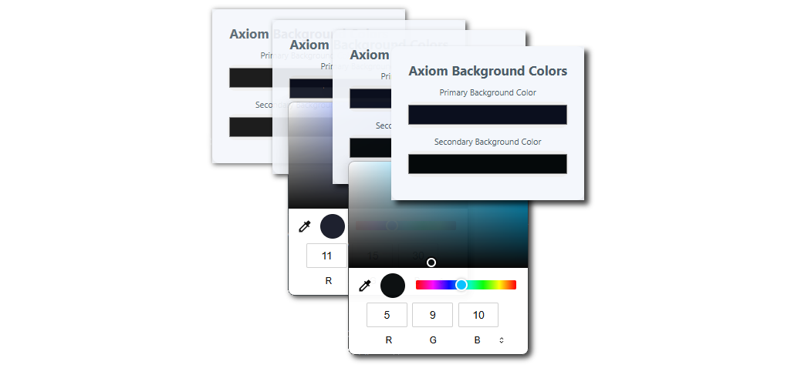

# Axiom Background Colors Extension

AxiomShift is a browser extension that allows you to customize the background colors of Axiom. You can set a primary and secondary background color, and the extension will apply them.

---

---

## Features
- Choose primary and secondary background colors using a color picker.
- The selected colors are saved and applied to every new Axiom page you visit.
- Supports all Chromium-based browsers, including Google Chrome, Microsoft Edge, Brave, and Opera.

## Installation

1. **Download the Extension Files**
   - Download or clone this repository to your local machine.

2. **Open Extensions Page**
   - Open your Chromium-based browser and go to the Extensions page by entering `chrome://extensions/` in the address bar.
   
3. **Enable Developer Mode**
   - At the top right, toggle the **Developer mode** switch to `ON`.

4. **Load the Extension**
   - Click the **Load unpacked** button.
   - Select the folder where you've downloaded or cloned the repository.

5. **Start Using the Extension**
   - Once the extension is installed, you should see the extension icon in the top-right corner of your browser.
   - Click on the icon to open the extension's popup.
   - Select your preferred **primary** and **secondary** background colors using the color pickers.
   - The selected colors will automatically apply to all the Axiom pages you visit.

## Usage

- **Primary Color**: This color will be applied to the primary background of Axiom pages.
- **Secondary Color**: This color will be applied to secondary background elements on Axiom.
  
These settings are saved locally, so you won't have to re-select them every time.